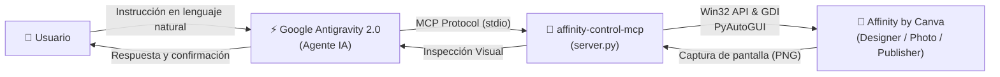

# Affinity MCP Server para Google Antigravity 2.0 (Windows)

<div align="center">

[](https://www.python.org/)
[](https://microsoft.com/windows)
[](https://modelcontextprotocol.io/)
[](https://antigravity.google/)
[](LICENSE)

**Controla la suite de diseño profesional Affinity by Canva mediante lenguaje natural desde Google Antigravity 2.0 y cualquier cliente compatible con MCP.**

[Características](#-características) •
[¿Cómo funciona?](#-cómo-funciona) •
[Requisitos](#-requisitos) •
[Instalación](#-instalación) •
[Configuración](#-configuración-en-antigravity-20) •
[Herramientas](#-herramientas-disponibles-17-tools) •
[Ejemplos de Prompts](#-ejemplos-de-prompts-para-antigravity)

</div>

---

## 💡 ¿De qué va este proyecto?

**Affinity MCP Server** es un puente basado en el estándar abierto [Model Context Protocol (MCP)](https://modelcontextprotocol.io/) que permite a agentes de inteligencia artificial —con especial enfoque en **Google Antigravity 2.0**— interactuar directamente con la suite creativa **Affinity by Canva** en sistemas Windows:

* 🎨 **Affinity Designer 2** (Diseño vectorial y UI)
* 📸 **Affinity Photo 2** (Edición ráster y retoque)
* 📰 **Affinity Publisher 2** (Maquetación y editorial)
* 🌐 **Canva Affinity Suite** (App unificada)

A diferencia de simples scripts de macros, este servidor proporciona a la IA un **bucle de retroalimentación visual en tiempo real (Visual Feedback Loop)**: el agente puede seleccionar herramientas, dibujar, organizar capas y **tomar capturas instantáneas de la ventana** para ver con sus propios "ojos" el resultado del diseño, corregirlo y seguir iterando.

---

## 🚀 Características principales

* **Detección inteligente de ventanas de Affinity**: Localización automática del proceso `Affinity.exe`, control de foco y posicionamiento.
* **Inspección visual en tiempo real**: Captura directa de la ventana de Affinity (`PrintWindow` / GDI nativo de Windows) para que los modelos multimodales (Gemini 2.5/3, Claude 3.5/3.7) evalúen el diseño creado.
* **Operaciones de documentos completas**: Nuevo documento, abrir proyectos (`.afdesign`, `.afphoto`, `.afpub`, `.psd`, `.svg`), guardar (`Ctrl+S`), Guardar como (`Ctrl+Shift+S`), exportar (`Ctrl+Alt+Shift+S`) y cerrar.
* **Selección de herramientas estándar**: Movimiento, nodo, pluma, pincel, borrador, formas geométricas, texto, degradados, cuentagotas, recorte y zoom.
* **Manipulación de capas**: Creación de capas de píxeles, capas vectoriales y máscaras.
* **Interacción precisa de entrada**: Clics, doble clic, clic derecho, arrastres de precisión (`drag`) para dibujo, entrada de texto y combinaciones avanzadas de teclas.
* **Control de flujo e historial**: Deshacer (`Ctrl+Z`), rehacer (`Ctrl+Y`) y ejecución de macros (`.afmacro`).

---

## 🧠 ¿Cómo funciona?



---

## 📋 Requisitos

1. **Sistema Operativo**: Windows 10 o Windows 11 (64-bit).
2. **Suite Affinity**: Affinity Designer, Affinity Photo, Affinity Publisher (v2 recomendada) o la aplicación unificada Canva Affinity instalada y activa.
3. **Python**: Versión 3.10 o superior.
4. **Cliente MCP**: [Google Antigravity 2.0](https://antigravity.google/), Claude Desktop, Cursor o cualquier cliente compatible con MCP.

---

## 📦 Instalación

### 1. Clonar el repositorio

```bash
git clone https://github.com/jimmypazosg/Affinity-mcp-antigravity.git
cd Affinity-mcp-antigravity
```

### 2. Crear y activar el entorno virtual

```powershell
# Crear entorno virtual
python -m venv .venv

# Activar en PowerShell
.venv\Scripts\Activate.ps1
```

### 3. Instalar dependencias

```powershell
pip install -r requirements.txt
```

---

## ⚙️ Configuración en Antigravity 2.0

Puedes registrar el servidor MCP de forma global en Antigravity o únicamente para un proyecto específico.

### Opción A: Configuración Global (Recomendada)

Edita o crea el archivo de configuración global de Antigravity en:
`%USERPROFILE%\.gemini\config\mcp_config.json` (por ejemplo `C:\Users\tu_usuario\.gemini\config\mcp_config.json`):

```json
{
  "mcpServers": {
    "affinity-mcp": {
      "command": "C:/ruta/a/tu/Affinity-mcp-antigravity/.venv/Scripts/python.exe",
      "args": [
        "C:/ruta/a/tu/Affinity-mcp-antigravity/server.py"
      ],
      "env": {
        "PYTHONIOENCODING": "utf-8"
      }
    }
  }
}
```

> [!TIP]
> Puedes usar como base el archivo [mcp_config.example.json](file:///c:/Users/jpazo/DEV/affinity-control-mcp/mcp_config.example.json) incluido en la raíz de este repositorio.

### Opción B: Configuración con `uv` (si usas uv en lugar de venv)

```json
{
  "mcpServers": {
    "affinity-mcp": {
      "command": "uv",
      "args": [
        "run",
        "--directory",
        "C:/ruta/a/tu/Affinity-mcp-antigravity",
        "server.py"
      ]
    }
  }
}
```

### Opción C: Configuración en Claude Desktop

En `%APPDATA%\Claude\claude_desktop_config.json`:

```json
{
  "mcpServers": {
    "affinity-mcp": {
      "command": "C:/ruta/a/tu/Affinity-mcp-antigravity/.venv/Scripts/python.exe",
      "args": [
        "C:/ruta/a/tu/Affinity-mcp-antigravity/server.py"
      ]
    }
  }
}
```

---

## 🛠️ Herramientas disponibles (17 Tools)

| Herramienta | Descripción |
| :--- | :--- |
| `affinity_status` | Obtiene el estado actual de Affinity: proceso activo, PID, dimensiones y título de ventana. |
| `affinity_launch` | Inicia Affinity si está cerrado o trae la ventana al frente con foco activo. |
| `affinity_screenshot` | Toma una captura de alta resolución de la ventana de Affinity para inspección visual. |
| `affinity_new_document` | Crea un nuevo lienzo o abre el cuadro de diálogo de ajustes predeterminados. |
| `affinity_open_file` | Abre un archivo de diseño existente (`.afdesign`, `.afphoto`, `.psd`, etc.). |
| `affinity_save` | Guarda el documento actual (`Ctrl+S`) o ejecuta "Guardar como" (`Ctrl+Shift+S`). |
| `affinity_export` | Abre el asistente de exportación rápida o por formato (`Ctrl+Alt+Shift+S`). |
| `affinity_close_document` | Cierra el documento actual (`Ctrl+W`). |
| `affinity_select_tool` | Selecciona herramientas (`move`, `pen`, `brush`, `rectangle`, `text`, `zoom`, etc.). |
| `affinity_add_layer` | Añade capas vectoriales, capas de píxeles o máscaras de recorte. |
| `affinity_mouse_action` | Ejecuta acciones de ratón relativas a la ventana (`click`, `double_click`, `drag`). |
| `affinity_type_text` | Escribe texto en capas o campos activos. |
| `affinity_keystroke` | Envía atajos con modificadores (`ctrl`, `alt`, `shift`). |
| `affinity_key_code` | Envía teclas especiales (`escape`, `enter`, `tab`, `delete`, etc.). |
| `affinity_undo_redo` | Deshace (`Ctrl+Z`) o rehace (`Ctrl+Y`) acciones un número determinado de veces. |
| `affinity_document_ops` | Operaciones rápidas de documento (acoplar, rotar lienzo, voltear). |
| `affinity_run_macro` | Ejecuta o importa archivos de macro (`.afmacro`). |

---

## 💬 Ejemplos de Prompts para Antigravity

Una vez configurado en Antigravity 2.0, puedes pedirle cosas como:

#### 1. Preparar un lienzo de trabajo
> *"Revisa si Affinity Designer está abierto. Si no lo está, ábrelo y crea un nuevo documento para redes sociales de 1080x1080 px."*

#### 2. Diseñar con retroalimentación visual
> *"Selecciona la herramienta de rectángulo en Affinity, dibuja un contenedor en el tercio superior del lienzo, agrega una capa de texto con 'Innovación 2026' y toma una captura de pantalla para verificar cómo quedó la composición."*

#### 3. Automatizar exportación
> *"Abre el proyecto `banner.afdesign` ubicado en mi carpeta de descargas, exporta una copia en formato PNG y cierra el documento."*

---

## 🔍 Solución de problemas comunes (Troubleshooting)

* **Affinity no recibe las pulsaciones o clics**: Asegúrate de que la ventana de Affinity no esté minimizada y que no se esté ejecutando como Administrador si tu terminal se ejecuta como usuario estándar.
* **Escalado de pantalla (DPI)**: Si utilizas escalado en Windows (por ejemplo, 125% o 150%), las coordenadas de `affinity_mouse_action` son calculadas relativas a la ventana identificada por la API de Windows.
* **Atajos de teclado**: Si la configuración regional de Affinity tiene atajos personalizados, asegúrate de que coincidan con la configuración estándar internacional.

---

## 👥 Créditos y Reconocimientos

* Desarrollado y mantenido para Windows y Antigravity por **[Jimmy Pazos](https://github.com/jimmypazosg)**.
* Inspirado en la implementación conceptual inicial para macOS de [sekharmalla/affinity-mcp-server](https://github.com/sekharmalla/affinity-mcp-server).
* Desarrollado sobre la especificación oficial de [Model Context Protocol (MCP)](https://github.com/modelcontextprotocol).

---

## 📄 Licencia

Este proyecto se distribuye bajo la licencia **MIT**. Consulta el archivo [LICENSE](LICENSE) para más información.
